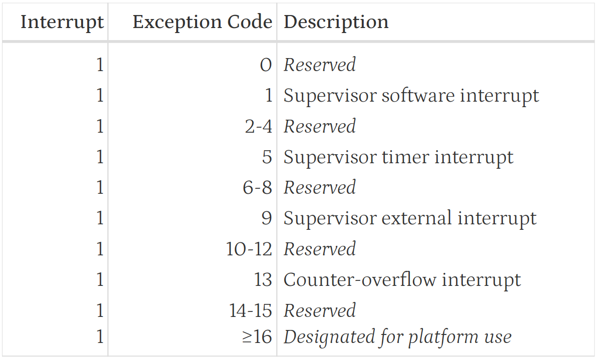
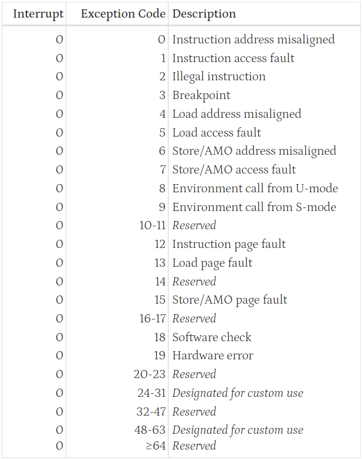

# Lab 4

In this lab, we need to handle exception and interrupt.

## Exception

We can't let a random user program touch our system, so all system operation should be done by *operation system*.
If a user program needs some system functions, it needs to use "system call" to ask the OS for help.
To notify the OS, it will raise an *exception*, and the OS will handle this exception.
We can then add some parameters into the exceptions to represent different system calls.

The `ecall` (environment call) instruction can cause an exception, and a higher level process will handle it.
For example, we know there are three different permission levels in RISC-V.
When a program run under U-mode, the `ecall` will be cached by S-mode.

```txt
+--------------------------+
| U-mode (user mode)       |
+--------------------------+
| S-mode (supervisor mode) |
+--------------------------+
| M-mode (machine mode)    |
+--------------------------+
```

Under S-mode, after handling the system call, we can use `sret` (S-mode return) instruction to return to U-mode program.

## Interrupt

Interrupt is a mechanism that allows the hardware tell the OS something happen.
When a interrupt happened, the hardware will call a function we set automatically, then the OS can handle this events.

## Trap handling

Both `ecall` and interrupt will enter the same handling function called *trap handler*.

We have said that the hardware will call this function automatically,
so we need to configure it during initialization our trap handling system.
The hardware will jump to the address set in `stvec` register. so we save the handler function address into it.

In trap handler, we have to do following things:

1. Save context
2. Handle trap
3. Restore context and return

### Save Context

What is context?\
Context is the register data in the CPU when a program is running and other necessary registers.
In RISC-V, we have `x1 ~ x31` 31 registers in the CPU.

To return the correct address after trap handling, we also need to store the address when trap happened.
This address is saved in `sepc` (supervisor exception program counter) by hardware automatically.

The processor state and permission status also need to keep the same after return from trap handler.
Those data is stored in `sstatus` register.

So, our context for trap handler is `x1 ~ x31`, `sepc` and `sstatus`.
We need to save the value in this registers into the stack before calling the trap handling function.

### Handle Trap

In the trap handler, we can use `scause` to identify what exception or interrupt happened.
According to the RISC-V ISC manual, here is the definition of `scuase`:




We can handle every trap we need in trap handler like this:

```c
if (scause & (1ULL << 63)) { // interrupt
    scause ^= (1ULL << 63);
    if (scause == 1){
        //...
    } else if (scause == 5){
        //...
    } else if (scause == 9){
        //...
    }
    // ...
} else { // exception
    if (scause == 1){
        //...
    } else if (scause == 2){
        //...
    } else if (scause == 3){
        //...
    }
    // ...
}
```

But, implement all handling logic in trap handler clearly not a good idea.
To decouple it, I design a handler register. We will talk about it later.

### Restore Context and Return

After handling the trap, we need to restore the context we saved before and use `sret` to return.

When an interrupt happened, the hardware will disable the global interrupt automatically before entering our trap handler.
The `sret` instruction will open the global interrupt and jump to the address stored in `sepc`.

## Trap Handler Design

In my design (also Linux or other OS), trap handler is just a dispatcher, it don't contain any handling logic.
Each handler is implemented by each component and register with trap handler during initialization.
When a trap happened, trap handler call the function pointer in the register table.

```c
typedef void (*intr_handler_t)(void *context);
typedef void (*excep_handler_t)(TrapFrame *tf, uint64_t stval);

intr_handler_t local_intr_table[MAX_LOCAL_INTR];
excep_handler_t exception_table[MAX_EXCEPTIONS];

void register_local_intr(uint32_t code, intr_handler_t handler) {
    local_intr_table[code] = handler;
}
void register_exception(uint32_t code, excep_handler_t handler) {
    exception_table[code] = handler;
}


void trap_handler(TrapFrame *tf) {
    // ...

    if (scause & (1ULL << 63)) { // interrupt
        scause ^= (1ULL << 63);
        local_intr_table[scause](NULL);
    } else { // exception
        exception_table[scause](tf, stval);
    }

    // ...
}
```

Voilà, the trap handler is so clean.

For an external interrupt, the PLIC component use the same design to handle interruption.

This is the overall design graph:

```txt
                               +------------------------------+
                               |         Trap Handler         |
                               | (Entry Point / reads scause) |
                               +--------------+---------------+
                                              |
                   +--------------------------+--------------------------+
                   |                                                     |
             [ Interrupts ]                                       [ Exceptions ]
       (Asynchronous, scause MSB = 1)                       (Synchronous, scause MSB = 0)
                   |                                                     |
     +-------------v-------------+                         +-------------v-------------+
     |     Interrupt Dispatch    |                         |     Exception Dispatch    |
     | (Calls saved func pointer)|                         | (Calls saved func pointer)|
     +-------------+-------------+                         +-------------+-------------+
                   |                                                     |
       +-----------+-----------+                                         |
       |                       |                                         v
[ scause == 9 ]         [ Other scause ]                     +-------------------------+
       |                       |                             |   Registered Exception  |
       v                       v                             |        Handlers         |
+-------------+      +-------------------+                   +-------------------------+
| PLIC Handler|      |  Other Registered |                   | - Page Fault            |
|             |      | Interrupt Handlers|                   | - Illegal Instruction   |
+------+------+      | (Timer, Software) |                   | - Environment Call      |
       |             +-------------------+                   |   (ecall), etc.         |
       |                                                     +-------------------------+
       | (Uses PLIC's internal
       |  device registry)
       v
+-------------+
|  Registered |
| Ext Devices |
+-------------+
| - UART      |
| - VirtIO    |
| - Mouse/Kbd |
+-------------+
```
